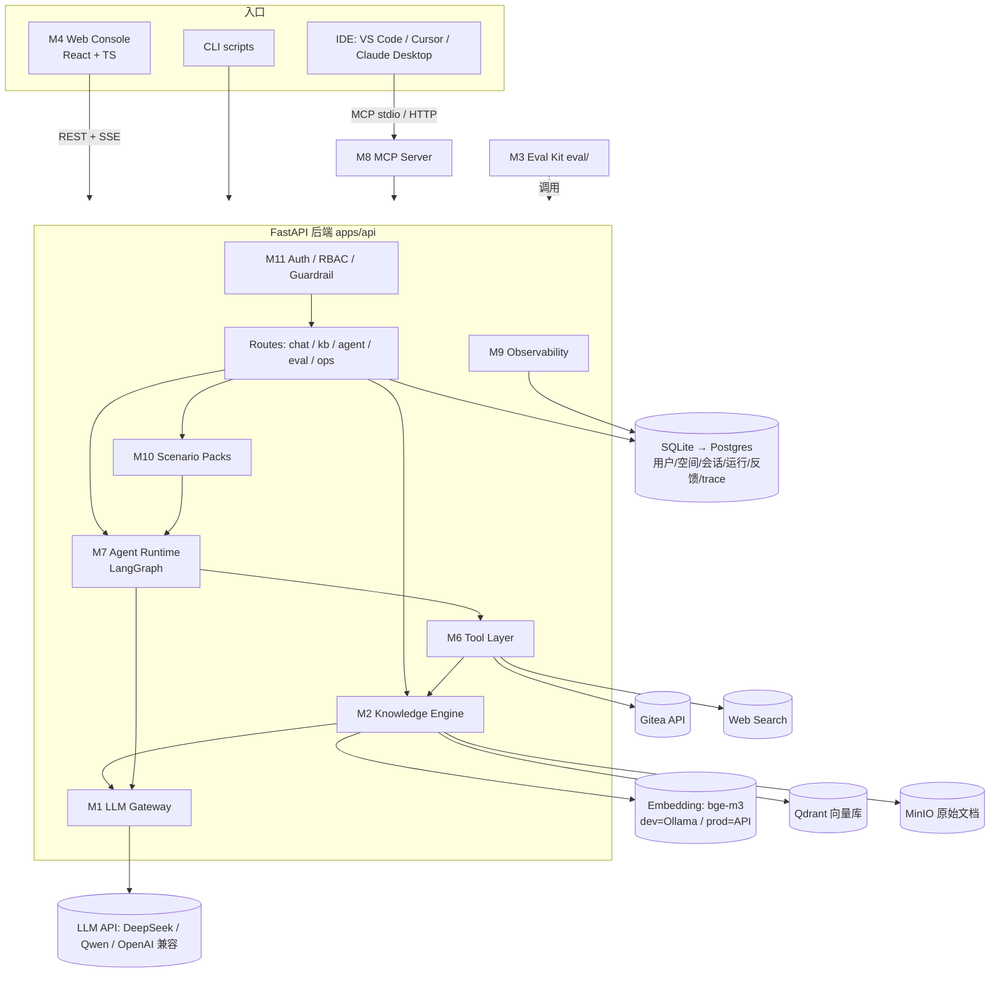

# DA-01 目标数字资产蓝图（Target Asset Blueprint）

> 本文件定义「半年后到底要交付一个什么东西」。
> **所有 phase / week / day 计划都必须在本文件里找到自己的「资产锚点」（模块编号 Mx.y + 版本号）**，找不到锚点的任务 = 跑偏，应降级或删除。
>
> - 上位文件：`GLOBAL_CONTEXT.md`（原则）、`PROJECT_CONFIG.md`（状态）、`history/AI半年稳态成长_求职能力_实际应用_资产化_新版计划.md`（总计划）
> - 为什么单独成文（符合 GLOBAL_CONTEXT §13「必要时才增加文件」）：总计划回答「怎么成长」，本文件回答「最终产品长什么样」，两者混写会让日计划无法精确定位。

---

## 0. 一句话定义

> **WorkPilot（工作代号，可改）：一个可私有部署的「研发工作 AI 助手平台」——把团队/个人的研发知识（文档、规范、代码仓库、Issue、运行手册）接入，用带引用的 RAG 回答问题，用可审批的 Agent 调用工具完成高频研发工作流（调研、需求拆解、评审、排障、周报），并通过 MCP 直接嵌入 IDE；自带评测、可观测、安全护栏和一键部署。**

它同时是：

| 身份                    | 说明                                                  |
| ----------------------- | ----------------------------------------------------- |
| DA-01 本体              | 第一个智能解决方案资产（GLOBAL_CONTEXT §3）           |
| 求职作品集 P1 / P2 / P3 | 同一个系统的三个里程碑，而不是三个互不相干的 Demo     |
| 个人效率工具            | 自己每天在研发工作中真实使用（数据合规前提下，见 §8） |
| 可售卖资产              | 开源核心 + 付费 Pro Kit（见 §10）                     |
| 可复用模板来源          | 第 22 周从中抽取 `personal-ai-engineering` 模板库     |

---

## 1. 为什么是这个资产（选型理由）

### 1.1 和 AI 招聘市场的对齐

总计划 §2.2 列出的高频 JD 能力，**每一项都能在 WorkPilot 里找到一个真实模块来证明**：

| JD 高频能力                               | WorkPilot 中的证明模块              | 证据文件                                        |
| ----------------------------------------- | ----------------------------------- | ----------------------------------------------- |
| Python / FastAPI / REST API               | M1、M2.6、全部后端                  | `apps/api/`                                     |
| React / TypeScript / AI UX                | M4 Web Console                      | `apps/web/`                                     |
| LLM API / Structured Output / Streaming   | M1 LLM Gateway                      | `apps/api/app/llm/`                             |
| Embedding / Vector DB / RAG / Rerank      | M2 Knowledge Engine                 | `apps/api/app/rag/`                             |
| Tool Calling / Agent Workflow / LangGraph | M6、M7                              | `apps/api/app/tools/`、`app/agent/`             |
| Memory / State / Human-in-the-loop        | M7.3、M7.4                          | `app/agent/memory.py`                           |
| MCP / Tool Integration / 企业系统集成     | M8                                  | `apps/mcp-server/`                              |
| Evaluation / LLM-as-a-judge / Badcase     | M3 Eval Kit                         | `eval/`                                         |
| Observability / Cost / Latency            | M9                                  | `app/obs/`、Ops 看板                            |
| Security / Guardrail / Prompt Injection   | M11                                 | `app/security/`、`eval/datasets/security.jsonl` |
| Docker / Cloud / CI/CD                    | M5 Deploy Kit                       | `deploy/`、`.gitea/workflows/`                  |
| AI-assisted development                   | 全程 Vibe Coding + 人工架构评审记录 | `docs/adr/`                                     |

### 1.2 和「Agent 结合工作内容提升效率」的对齐

当前 AI 落地最成熟、企业最愿意付费的方向之一是 **「企业知识 + 研发效能 Agent」**：内部知识问答、需求→任务拆解、代码评审辅助、故障排查、自动周报。你是 5 年全栈 / 在职前端，这些场景就是自己每天的工作，**痛点真实、可自测、可讲故事**。

### 1.3 和 GLOBAL_CONTEXT「问题决定技术」的协调

- **固定的**：能力骨架（M0–M9、M11）——这是求职线和工程线必须证明的通用能力，与具体痛点无关。
- **由真实痛点决定的**：场景包 M10（第 3 周 Day13 从问题池里选 1 主 + 1 辅）、语料来源、Agent 工具集的具体组合、交付形态的侧重（Web / MCP / CLI）。
- 若第 1–3 周发现的真实痛点**完全不在研发工作域**，按 §12「变更规则」处理，而不是硬套。

---

## 2. 目标用户与使用场景

| 用户                    | 场景                           | 用 WorkPilot 前                    | 用 WorkPilot 后                                          |
| ----------------------- | ------------------------------ | ---------------------------------- | -------------------------------------------------------- |
| 自己（在职前端/全栈）   | 查规范、查历史决策、查组件用法 | 翻 Confluence/飞书/群聊 10–30 分钟 | 带引用答案 < 1 分钟                                      |
| 自己                    | 新需求拆任务                   | 手工读需求 → 列任务 → 建 Issue     | Agent 生成拆解草案 → 人审批 → 自动建 Issue               |
| 小型研发团队（3–20 人） | 新人上手、重复问答             | 老人反复回答同样问题               | 知识空间 + 问答 + 反馈闭环                               |
| 独立开发者              | 技术调研                       | 搜索 + 手工整理                    | Research Agent 输出带引用报告                            |
| 任意 IDE 用户           | 写代码时查团队知识             | 切出 IDE 搜索                      | 在 VS Code / Cursor / Claude Desktop 中通过 MCP 直接调用 |

---

## 3. 最终产品功能清单（v2.0 = 第 26 周交付形态）

### F1 知识空间（Workspace & Knowledge Base）

- 多工作空间：每个团队 / 项目一个空间，数据完全隔离。
- 数据接入：上传 Markdown / PDF / HTML；同步 Gitea 仓库的 `docs/` 与 README；导入 Issue。
- 自动处理：解析 → 清洗 → 分块 → 向量化 → 入库，显示处理状态与失败原因。
- 文档管理：列表、删除、重建索引、查看分块。

### F2 知识问答（Grounded Q&A）

- 流式回答 + 段落级引用（点击跳到原文片段）。
- 知识不足时明确拒答（「知识库中没有找到…」），不编造。
- 多轮对话、历史记录、👍/👎 + 原因反馈 → 自动进入 Badcase 池。

### F3 Agent 任务中心（Agent Runs）

- 内置任务：技术调研报告、仓库分析、需求→任务拆解、PR 评审建议、报错排查、周报生成（具体启用哪几个由 M10 场景包决定）。
- 步骤时间线可视化：Plan → Tool Call → Observation → Decision → Answer。
- **写操作必须人工审批**（如创建 Issue、写评论），可拒绝 / 修改后批准。
- 任务可中断、可恢复（checkpoint）。

### F4 IDE 集成（MCP）

- WorkPilot MCP Server：在 VS Code Copilot / Cursor / Claude Desktop 中调用 `kb_search`、`kb_ask`、`gitea_*`、场景工具。
- 同时能作为 MCP Client 接入外部 MCP Server 作为 Agent 工具。

### F5 评测中心（Eval Center）

- 数据集管理（RAG 问答集、Agent 任务集、安全攻击集）。
- 一键评测、版本对比、回归门禁（CI 中跑小样本）。
- Badcase 库：分类、根因、修复状态、回归用例。

### F6 运维看板（Ops）

- 请求量、P50/P95 延迟、错误率、Token、成本（按空间/用户/天）。
- 预算上限：超过日预算自动降级（换便宜模型 / 拒绝）。
- Trace 查看：一次请求的 LLM 调用 / 检索 / 工具调用明细。

### F7 安全与权限

- 登录（JWT）、角色（owner / member / viewer）、空间隔离。
- Prompt Injection 防护（直接注入 + 来自网页/文档/Issue 的间接注入）。
- 敏感信息脱敏、工具权限白名单、审计日志、限流。

### F8 交付与运维

- `docker compose up -d` 一键部署（dev / prod 两套）。
- 备份 / 恢复脚本 + 30 分钟内恢复演练记录。
- 完整文档：README、架构、部署、运行手册、API。

### 明确不做（Non-goals，防跑偏）

- 不做通用聊天产品、不做模型训练 / 微调、不做 Multi-Agent 群聊、不上 Kubernetes、不做移动端 App、不接入硬件。
- 不做定制外包式的「为某公司接系统」。

---

## 4. 系统架构



通用解决方案闭环在 WorkPilot 中的映射：

| 闭环环节        | WorkPilot 对应                             |
| --------------- | ------------------------------------------ |
| 现实问题        | M10 场景包定义的研发痛点                   |
| 感知 / 数据输入 | M2.1 Ingest（文档、仓库、Issue）、用户输入 |
| AI 理解         | M1 Gateway + M2 检索上下文                 |
| 决策 / 规划     | M7 Agent Planner（LangGraph 节点）         |
| 执行            | M6 Tools（读仓库、搜网页、建 Issue）       |
| 反馈            | F2 👍/👎、F3 审批结果、M9 trace            |
| 评测 / 优化     | M3 Eval Kit + Badcase → 回归               |

---

## 5. 模块拆解（资产锚点编号）

> 日计划第 1 节「资产锚点」必须引用这里的编号。

### M0 研发底座 Foundation（C 线）

| 编号 | 子模块            | 产物                                              | 周    |
| ---- | ----------------- | ------------------------------------------------- | ----- |
| M0.1 | Docker 运行时     | Docker Desktop                                    | W1 ✅ |
| M0.2 | Gitea 代码托管    | `http://localhost:3000`、`projects` 仓库          | W1 ✅ |
| M0.3 | 项目规范 + 模板   | `PROJECT_STANDARD.md`、`ai-project-template` 仓库 | W1    |
| M0.4 | 对象存储 + 向量库 | MinIO（9000/9001）、Qdrant（6333）                | W2    |
| M0.5 | 备份 / 恢复       | `infra/scripts/backup.sh`、`restore.sh`           | W2    |

### M1 LLM Gateway（B 线）

| 编号 | 子模块            | 说明                                                            | 周       |
| ---- | ----------------- | --------------------------------------------------------------- | -------- |
| M1.1 | Provider 抽象     | OpenAI 兼容 SDK，一处配置切换 DeepSeek / Qwen / OpenAI / Ollama | W2       |
| M1.2 | 可靠性            | timeout、指数退避 retry、provider fallback                      | W2 / W11 |
| M1.3 | Structured Output | Pydantic schema + JSON mode + 校验失败重试                      | W3       |
| M1.4 | Streaming         | SSE 流式输出                                                    | W3       |
| M1.5 | Token / 成本计量  | 每次调用记录 tokens、价格、耗时                                 | W3 / W15 |
| M1.6 | Prompt 版本化     | `prompts/*.md`，带版本号与变更记录                              | W3       |

### M2 Knowledge Engine / RAG（B 线，= P1 核心）

| 编号 | 子模块           | 说明                                                                          | 周      |
| ---- | ---------------- | ----------------------------------------------------------------------------- | ------- |
| M2.1 | Ingest           | Markdown / PDF / HTML / Gitea 仓库 docs 加载，统一 `Document` 模型 + metadata | W4      |
| M2.2 | Chunking         | 按标题结构切分 + 定长兜底，可配置 size / overlap                              | W4 / W5 |
| M2.3 | Embedding + 索引 | bge-m3（1024 维），Qdrant collection 按 workspace 区分                        | W4      |
| M2.4 | Retrieval        | dense → hybrid（稀疏+稠密）→ metadata 过滤 → 可选 rerank → 可选 query rewrite | W4 / W5 |
| M2.5 | Grounded Answer  | 引用编号、拒答策略、置信提示                                                  | W4      |
| M2.6 | KB API           | `POST /v1/kb/ingest`、`POST /v1/kb/ask`、`GET /v1/kb/docs`                    | W4 / W6 |

### M3 Eval Kit（B 线，贯穿）

| 编号 | 子模块       | 说明                                                        | 周        |
| ---- | ------------ | ----------------------------------------------------------- | --------- |
| M3.1 | 数据集规范   | `eval/datasets/*.jsonl` 统一 schema                         | W4 / W5   |
| M3.2 | RAG 指标     | hit@k、MRR、引用正确率、拒答正确率、LLM-judge 正确性/忠实度 | W5        |
| M3.3 | Agent 指标   | 工具选择准确率、工具成功率、任务成功率、步数、延迟、成本    | W14       |
| M3.4 | Badcase 库   | `eval/badcases/badcases.md` + 分类法                        | W5 起     |
| M3.5 | 回归 + 门禁  | `make eval`、基线对比、CI 小样本门禁                        | W14 / W22 |
| M3.6 | 在线反馈闭环 | 👍/👎 → badcase → 回归用例                                  | W6 / W20  |

### M4 Web Console（B/D 线，前端优势展示）

| 编号 | 子模块                           | 周        |
| ---- | -------------------------------- | --------- |
| M4.1 | Chat：流式、引用面板、历史、反馈 | W6        |
| M4.2 | 知识库管理：上传、状态、分块查看 | W6        |
| M4.3 | Agent 运行视图：步骤时间线、审批 | W10 / W12 |
| M4.4 | Ops / Eval 看板                  | W15 / W20 |
| M4.5 | 登录与空间切换                   | W19       |

### M5 Deploy Kit（C 线）

| 编号 | 子模块                                                     | 周       |
| ---- | ---------------------------------------------------------- | -------- |
| M5.1 | Dockerfile（api 多阶段 / web 静态）+ compose（dev / prod） | W7       |
| M5.2 | 配置 / 密钥 / 健康检查 / JSON 日志                         | W7       |
| M5.3 | 云部署 + HTTPS（Caddy）                                    | W7       |
| M5.4 | CI/CD（Gitea Actions，语法兼容 GitHub Actions）            | W7 / W19 |
| M5.5 | 备份 / 恢复 / 运行手册                                     | W7 / W21 |

### M6 Tool Layer（B 线，= P2 核心之一）

| 编号 | 子模块        | 说明                                                                                                                            | 周       |
| ---- | ------------- | ------------------------------------------------------------------------------------------------------------------------------- | -------- |
| M6.1 | Tool Registry | Pydantic 入参 → JSON Schema；权限等级 `read` / `write` / `dangerous`                                                            | W9       |
| M6.2 | 内置工具      | `kb_search`、`web_search`、`gitea_repo_read`、`gitea_issue_read`、`gitea_issue_create`(write)、`http_fetch`、`calculator`(教学) | W9       |
| M6.3 | 执行保护      | 超时、结果截断、错误归一化、审计                                                                                                | W9 / W15 |

### M7 Agent Runtime（B 线，= P2 核心）

| 编号 | 子模块                                                     | 周        |
| ---- | ---------------------------------------------------------- | --------- |
| M7.1 | 手写 plan → act → observe 循环（v0，理解原理）             | W10       |
| M7.2 | LangGraph 工作流（State / Node / Edge / retry / fallback） | W11       |
| M7.3 | Memory：会话（checkpointer）+ 长期（Qdrant `memories`）    | W12       |
| M7.4 | Human-in-the-loop：写工具审批（interrupt）                 | W12       |
| M7.5 | Research Agent：带引用调研报告                             | W10 / W11 |

### M8 MCP Integration（B 线）

| 编号 | 子模块                                                       | 周  |
| ---- | ------------------------------------------------------------ | --- |
| M8.1 | WorkPilot MCP Server（stdio + streamable HTTP + token 鉴权） | W13 |
| M8.2 | MCP Client：Agent 调用外部 MCP Server                        | W13 |

### M9 Observability & Production（C/B 线）

| 编号 | 子模块                                                         | 周       |
| ---- | -------------------------------------------------------------- | -------- |
| M9.1 | request_id / trace / span（每次 LLM、检索、工具调用一条 span） | W7 / W15 |
| M9.2 | Token / 成本账本 + 日预算守卫                                  | W15      |
| M9.3 | 限流 / 超时 / 重试策略集中管理                                 | W15      |
| M9.4 | 错误追踪 + 看板数据接口                                        | W15      |

### M10 Scenario Packs 场景包（A 线，DA-01 的「价值层」）

> 第 3 周 Day13 从问题池按评分选 **1 主 + 1 辅**；未选中的保留为 Backlog。默认候选：

| 编号 | 场景包                              | 输入 → 输出                                          | 依赖模块   |
| ---- | ----------------------------------- | ---------------------------------------------------- | ---------- |
| SP-A | 研发知识问答（基线，必选，= P1）    | 问题 → 带引用答案                                    | M2         |
| SP-B | 需求 → 任务拆解 → Issue 草案        | 需求文档 → 结构化任务列表 → 审批后写入 Gitea Issue   | M2 M6 M7.4 |
| SP-C | PR / 代码变更评审助手               | diff + 团队规范 KB → 评审建议                        | M2 M6      |
| SP-D | 报错 / 日志排查助手                 | 报错日志 → 检索 runbook + 代码 → 根因假设 + 排查步骤 | M2 M6 M7   |
| SP-E | 周报 / 日报生成                     | git log + Issue → 周报草稿                           | M6         |
| SP-F | 技术调研报告（= P2 Research Agent） | 主题 → 多源检索 → 带引用报告                         | M6 M7.5    |

### M11 Security & Multi-tenancy（C/B 线，= P3 核心）

| 编号  | 子模块                                                      | 周        |
| ----- | ----------------------------------------------------------- | --------- |
| M11.1 | 认证 JWT + 用户 / 空间 / 角色                               | W19       |
| M11.2 | 数据隔离（DB 行级 workspace_id + Qdrant payload 过滤）      | W19       |
| M11.3 | Guardrails：直接/间接注入、输出校验、PII 脱敏、过度代理控制 | W15 / W21 |
| M11.4 | 审计日志、密钥管理、限流                                    | W21       |

### M12 Delivery & Commercial（A 线）

| 编号  | 子模块                                                     | 周        |
| ----- | ---------------------------------------------------------- | --------- |
| M12.1 | 开源核心（GitHub 公共仓库）+ 文档                          | W8 / W16  |
| M12.2 | Pro Kit（付费）：生产部署包 + 场景包 + 评测模板 + 部署指南 | W16 / W22 |
| M12.3 | 产品页 + SEO 技术文章（与作品集共用）                      | W16 / W23 |
| M12.4 | 在线 Demo（演示账号 + 配额）                               | W23       |

### M13 Career Pack（D 线）

| 编号  | 子模块                                            | 周                 |
| ----- | ------------------------------------------------- | ------------------ |
| M13.1 | AI 岗位能力矩阵 + JD 追踪                         | W2 起，每 2 周更新 |
| M13.2 | 项目写作：P1 / P2 / P3 技术复盘                   | W8 / W16 / W23     |
| M13.3 | 简历 ×3（Frontend / AI Full-Stack / AI Engineer） | W10 / W16 / W24    |
| M13.4 | 面试题库（≥30）+ System Design + STAR ×3          | W8 起 / W25        |
| M13.5 | Portfolio 网站                                    | W23                |

### M14 可复用工程模板（资产沉淀）

`personal-ai-engineering/`：`rag-template`、`agent-template`、`evaluation-template`、`fastapi-template`、`docker-template`、`ai-observability`、`prompts`、`badcases`、`datasets`、`interview`（W22 抽取）。

---

## 6. 仓库与目录（落地方案）

### 6.1 本机工作区

```text
~/lab/
├── projects/                 # Gitea 仓库 projects（Day02 已建）= 实验室笔记本
│   ├── product-lab/          # A 线：痛点池、DA-01 决策、商业化文档
│   ├── ai-lab/               # B 线：一次性学习实验（不进产品的代码）
│   ├── infra/                # C 线：个人私有云 compose、备份脚本
│   └── career/               # D 线：能力矩阵、JD 追踪、简历、面试题（Day06 新增）
├── ai-project-template/      # Gitea 仓库（Day04–05），新项目从这里复制
├── workpilot/                # Gitea 仓库（Day05 创建）= DA-01 代码，W8 起镜像到 GitHub
└── personal-ai-engineering/  # Gitea 仓库（W22 抽取）
```

> 注意（Day02 经验）：仓库必须先在 Gitea Web UI 创建，再 `git clone` 到本地，不要在本地 `git init` 后指望 Gitea 自动识别。

### 6.2 workpilot 仓库最终结构

```text
workpilot/
├── README.md                    # 定位 / 快速启动 / 架构图 / 截图 / 评测结果
├── PROJECT_STANDARD.md          # 从模板继承的规范（目录、命名、提交）
├── Makefile                     # 统一入口：dev / test / lint / up / down / eval / backup
├── .env.example                 # 所有环境变量键 + 注释，无真实值
├── .gitignore  .editorconfig
├── apps/
│   ├── api/                     # Python 3.12 + FastAPI（uv 管理）
│   │   ├── pyproject.toml
│   │   ├── app/
│   │   │   ├── main.py          # FastAPI 实例、中间件、路由挂载
│   │   │   ├── core/            # config.py(pydantic-settings) logging.py errors.py
│   │   │   ├── llm/             # M1: gateway.py providers.py schemas.py pricing.py
│   │   │   ├── rag/             # M2: loaders/ chunking.py embedding.py store.py retrieve.py answer.py
│   │   │   ├── tools/           # M6: registry.py builtin/*.py
│   │   │   ├── agent/           # M7: graph.py state.py nodes/ memory.py hitl.py
│   │   │   ├── scenarios/       # M10: sp_a_kb_qa/ sp_b_req_breakdown/ ...
│   │   │   ├── security/        # M11: auth.py rbac.py guardrails.py redact.py
│   │   │   ├── obs/             # M9: trace.py cost.py ratelimit.py
│   │   │   ├── db/              # models.py session.py；W19 起 alembic/
│   │   │   └── routes/          # health.py chat.py kb.py agent.py eval.py ops.py
│   │   └── tests/               # pytest：unit/ integration/
│   ├── web/                     # Vite + React + TS（pnpm）
│   │   └── src/{pages,components,api,hooks,lib}
│   └── mcp-server/              # M8: server.py（官方 mcp SDK / FastMCP）
├── prompts/                     # M1.6：qa_answer.v1.md、planner.v1.md ...
├── eval/                        # M3
│   ├── datasets/                # kb_qa.jsonl agent_tasks.jsonl security.jsonl scenario_*.jsonl
│   ├── runners/                 # run_rag_eval.py run_agent_eval.py
│   ├── reports/                 # YYYYMMDD-<name>.md（提交到 Git）
│   └── badcases/badcases.md
├── data/                        # 本地语料（gitignore；仅保留 sample/ 公开样例）
├── deploy/                      # M5
│   ├── docker-compose.yml       # dev：api web qdrant minio
│   ├── docker-compose.prod.yml  # prod：+ caddy postgres
│   ├── Caddyfile
│   └── scripts/                 # backup.sh restore.sh healthcheck.sh
├── scripts/                     # ingest.sh chat.py seed_eval.py
├── docs/
│   ├── architecture.md          # mermaid 架构图 + 数据流
│   ├── adr/                     # 0001-llm-provider.md 0002-vector-db.md ...
│   ├── runbook.md               # 部署 / 备份 / 恢复 / 排障
│   ├── api.md
│   └── portfolio/               # p1.md p2.md p3.md（求职写作）
└── .gitea/workflows/ci.yml      # lint + test + build + eval-smoke
```

---

## 7. 技术栈（固定基线，变更需写 ADR）

| 层         | 选择                                                                    | 理由                                       | 备选                                |
| ---------- | ----------------------------------------------------------------------- | ------------------------------------------ | ----------------------------------- |
| 后端       | Python 3.12 + FastAPI + Pydantic v2 + uv                                | JD 最高频；类型化；uv 快                   | —                                   |
| 前端       | Vite + React 18 + TypeScript + Tailwind                                 | 你的主场；展示 AI UX                       | Next.js（不需要 SSR 时不用）        |
| LLM        | DeepSeek `deepseek-chat`（OpenAI 兼容）                                 | 便宜、中文好、兼容 OpenAI SDK              | Qwen（DashScope 兼容模式）/ OpenAI  |
| Embedding  | `bge-m3`（1024 维）：dev 用 Ollama 本地，prod 用 SiliconFlow 同模型 API | 同模型保证向量一致；本地零成本             | —                                   |
| 向量库     | Qdrant                                                                  | 单容器、支持 hybrid、payload 过滤、JD 常见 | pgvector                            |
| 业务库     | SQLite（W6）→ Postgres 16（W19，Alembic）                               | 先简单，生产再升级                         | —                                   |
| 对象存储   | MinIO（S3 API）                                                         | 原始文档与备份；S3 技能可迁移              | 本地文件                            |
| Agent      | LangGraph                                                               | JD 高频；State/HITL/checkpoint 原生        | 手写（W10 先手写理解原理）          |
| MCP        | 官方 `mcp` Python SDK（FastMCP）                                        | 标准实现                                   | —                                   |
| Web Search | Tavily（免费额度）                                                      | 为 Agent 设计                              | `ddgs`                              |
| 可观测     | 自研轻量 trace 表（DB）+ JSON 日志；可选 Langfuse                       | 零依赖；Langfuse 自托管太重                | Langfuse Cloud 免费档（仅公开数据） |
| 部署       | Docker Compose + Caddy（自动 HTTPS）                                    | 单机足够                                   | —                                   |
| 云         | 2C4G 轻量服务器（香港/新加坡区免备案）或 Cloudflare Tunnel 暴露本机     | ≤ ¥100/月                                  | —                                   |
| CI         | Gitea Actions + act_runner（语法兼容 GitHub Actions）                   | 自托管；W8 起可加 GitHub Actions           | —                                   |

预算估算（半年）：LLM API ≈ ¥300、Embedding ≈ ¥0–50、云服务器 ≈ ¥400–600、域名 ≈ ¥60 → **合计 < ¥1100**，远低于 1.5w 上限。

---

## 8. 数据与合规红线（「结合工作内容」的前提）

1. **公司机密代码 / 文档 / 工单一律不进入外部 LLM API。**
2. 开发与评测语料只用三类：① 自己的笔记与本项目文档；② 公开开源文档（如 React、Vite、FastAPI、Qdrant 文档、开源仓库）；③ **手工改写脱敏**的工作场景样例（去公司名、人名、业务数据）。
3. 若未来想在公司内真实使用：必须先获得许可，用公司基础设施 + 本地模型（Ollama），**不在本项目时间内做**。
4. 不在主业时间开发 WorkPilot；工作中只「记录痛点」，不「开发副业」。
5. 所有对外公开仓库 / Demo 在发布前跑一遍敏感信息检查（W8、W16、W23）。

---

## 9. 版本里程碑（每个版本 = 一个可演示状态）

| 版本     | 周     | 可演示内容                                                       | 作品集身份  |
| -------- | ------ | ---------------------------------------------------------------- | ----------- |
| v0.0     | W1     | 仓库骨架 + 规范 + 模板                                           | —           |
| v0.1     | W2–3   | LLM Gateway：结构化输出、流式、成本记录、CLI 聊天（LLM 应用 v0） | P1 前导     |
| v0.2     | W4     | RAG MVP：导入文档 → 带引用回答                                   | P1          |
| v0.3     | W5     | RAG 优化 + 50 题评测 + Badcase                                   | P1          |
| v0.4     | W6     | Web Console（流式 / 引用 / 历史 / 反馈 / 上传）                  | P1          |
| **v0.5** | W7–8   | **P1 发布：WorkPilot Knowledge 云端可访问 + 作品集**             | **P1 完成** |
| v0.6     | W9     | Tool Layer + 工具调用 Demo                                       | P2          |
| v0.7     | W10    | Research Agent v0（手写循环）                                    | P2          |
| v0.8     | W11–12 | LangGraph Agent + Memory + HITL                                  | P2          |
| v0.9     | W13    | MCP Server / Client                                              | P2          |
| **v1.0** | W14–16 | **P2 发布：Agent 评测 + 可观测 + 生产护栏 + 作品集**             | **P2 完成** |
| v1.1     | W17–18 | DA-01 主场景包 MVP                                               | P3          |
| v1.2     | W19    | Postgres + 登录 + 多空间 + 异步导入 + 自动部署                   | P3          |
| v1.3     | W20    | 场景评测 + 在线反馈闭环                                          | P3          |
| v1.4     | W21    | 安全加固（OWASP LLM Top 10 对照）                                | P3          |
| **v2.0** | W22–23 | **P3 发布：生产级解决方案 + 回归体系 + 在线 Demo + Pro Kit**     | **P3 完成** |
| —        | W24–26 | 简历 / 面试 / 复盘 / DA-02 规划（不加功能）                      | —           |

---

## 10. 商业化形态（A 线，被动、标准化、不接外包）

| 层                    | 内容                                                                                     | 价格                 | 渠道                                         |
| --------------------- | ---------------------------------------------------------------------------------------- | -------------------- | -------------------------------------------- |
| 开源核心（MIT）       | M1 M2 M3 M4 M6 M7 基础版                                                                 | 免费                 | GitHub（作品集 + 被动流量入口）              |
| Pro Kit（一次性买断） | 生产部署包（Postgres/认证/RBAC/Caddy/备份）+ 主场景包 + 评测模板 + 部署手册 + 6 个月更新 | ¥199–499（W16 定价） | 面包多 / Gumroad / 爱发电                    |
| 内容                  | 技术复盘文章（同时是作品集与 SEO）                                                       | 免费                 | 个人博客 + 掘金 / 知乎（只发布，不私聊拓客） |

收入不是半年唯一验收指标；**「有人下载/试用/Star + 至少 1 次付费尝试」** 即视为商业化验证有效。

---

## 11. 半年验收指标（初始目标，W5 拿到基线后可调整并记录到 CHANGELOG）

| 维度     | 指标                                                | 目标                     |
| -------- | --------------------------------------------------- | ------------------------ |
| P1 RAG   | 50 题：hit@5 / 引用正确率 / 库外拒答率              | ≥ 0.85 / ≥ 0.80 / ≥ 0.80 |
| P1 性能  | P95 延迟 / 单次成本                                 | < 8s / < ¥0.02           |
| P2 Agent | 30 任务：任务成功率 / 工具选择准确率 / 平均步数     | ≥ 0.70 / ≥ 0.85 / ≤ 6    |
| P2 安全  | 未经审批的写操作                                    | 0                        |
| P3 场景  | 20 个场景用例 rubric 通过率                         | ≥ 0.75                   |
| P3 安全  | 20 条注入/越权攻击用例拦截率                        | 100%                     |
| 运维     | 干净环境恢复时间                                    | < 30 分钟                |
| 真实使用 | 自己在研发中真实使用会话数（脱敏语料）              | ≥ 30 次，有使用日志      |
| 求职     | 3 个项目 3 分钟讲解 + 2 个系统设计题 + ≥30 道面试题 | 全部能脱稿讲             |
| 资产     | `personal-ai-engineering` 模板库                    | 6 个模板可直接复制使用   |

---

## 12. 计划对齐规则（防跑偏）

1. 每个 phase / week / day 文件都必须有「资产锚点」：引用 §5 的模块编号 + §9 的版本号。
2. 每天结束问一句：**「今天之后，WorkPilot 多了哪个能被演示或被测量的东西？」** 答不出来 = 当天只算学习，次日补产出。
3. 新技术 / 新功能进入计划的条件：能挂到 §5 某个模块下，且不做会阻碍当前版本里程碑；否则进 Backlog。
4. 第 3 周 Day13 选定场景包后，在本文件 §10 / M10 标注「已选」，并在 `PROJECT_CONFIG.md` 回填 DA-01 状态。
5. **变更规则**：若真实痛点证明研发工作域不成立，可替换 M10 场景包与语料，但 M0–M9、M11 能力骨架保持不变（它们服务求职与工程线）；变更写入 `plan/CHANGELOG.md`。

---

## 附录 A：每日 → 模块构建路线（Day01–Day77）

| Day | 日期  | 周  | 任务                                      | 资产锚点            | 当日 P0 产出                            |
| --- | ----- | --- | ----------------------------------------- | ------------------- | --------------------------------------- |
| 01  | 09-28 | W1  | Docker 环境 ✅                            | M0.1                | Docker 可用                             |
| 02  | 09-29 | W1  | Gitea + 三目录 ✅                         | M0.2                | Gitea + `projects` 仓库                 |
| 03  | 09-30 | W1  | 研发工作痛点池 v0                         | M10                 | `product-lab/pain-pool.md` ≥ 8 条       |
| 04  | 10-01 | W1  | 项目规范（目录/命名/提交/环境变量）       | M0.3                | `PROJECT_STANDARD.md` + 模板骨架        |
| 05  | 10-02 | W1  | 工程模板 + 创建 workpilot 仓库            | M0.3 / v0.0         | `ai-project-template`、`workpilot` 仓库 |
| 06  | 10-03 | W2  | AI 岗位能力矩阵 v1                        | M13.1               | `career/capability-matrix.md`           |
| 07  | 10-04 | W2  | Python 工具链 + FastAPI 骨架              | M1 前置             | `apps/api` `/health` + pytest           |
| 08  | 10-05 | W2  | LLM Gateway v0                            | M1.1 M1.2           | `/v1/chat` + 重试超时                   |
| 09  | 10-06 | W2  | MinIO + Qdrant + Ollama bge-m3            | M0.4                | `infra/compose` + 冒烟脚本              |
| 10  | 10-07 | W2  | 备份恢复 + 痛点分类 + 周复盘              | M0.5 / M10          | `backup.sh` 恢复演练                    |
| 11  | 10-08 | W3  | Structured Output + Prompt 版本化         | M1.3 M1.6           | `/v1/extract` + `prompts/`              |
| 12  | 10-09 | W3  | Streaming SSE + 成本记录 + CLI 聊天       | M1.4 M1.5           | `/v1/chat/stream` + `scripts/chat.py`   |
| 13  | 10-10 | W3  | DA-01 决策：场景包选型                    | M10                 | `docs/product/da01-definition.md`       |
| 14  | 10-11 | W3  | LLM 应用 v0 + 10 题冒烟                   | v0.1                | tag `v0.1.0`                            |
| 15  | 10-12 | W4  | 语料准备 + Ingest                         | M2.1                | `rag/loaders` + 语料 ≥ 30 篇            |
| 16  | 10-13 | W4  | Chunking + Embedding + Qdrant 入库        | M2.2 M2.3           | `scripts/ingest.sh` 跑通                |
| 17  | 10-14 | W4  | 检索 + 带引用回答 + KB API                | M2.4 M2.5 M2.6      | `/v1/kb/ask`                            |
| 18  | 10-15 | W4  | 20 题种子集 + 首批 Badcase                | M3.1 M3.4 / v0.2    | tag `v0.2.0`                            |
| 19  | 10-16 | W5  | 评测集 50 题 + 检索指标 runner            | M3.1 M3.2           | `run_rag_eval.py` 基线报告              |
| 20  | 10-17 | W5  | 检索实验（chunk/topk/hybrid/rewrite）     | M2.2 M2.4           | 实验对比表                              |
| 21  | 10-18 | W5  | LLM-judge + Badcase 分类 + 定配置         | M3.2 M3.4 / v0.3    | 评测报告 v1                             |
| 22  | 10-19 | W6  | Web 脚手架 + 聊天页                       | M4.1                | `apps/web` 可对话                       |
| 23  | 10-20 | W6  | 流式渲染 + 引用面板 + 状态                | M4.1                | 引用可点击                              |
| 24  | 10-21 | W6  | 会话历史（SQLite）+ 反馈                  | M4.1 M3.6           | 👍👎 入库                               |
| 25  | 10-22 | W6  | 知识库管理页 + E2E 冒烟                   | M4.2 / v0.4         | 上传 → 可问答                           |
| 26  | 10-23 | W7  | Dockerfile + compose 全栈                 | M5.1                | `make up` 一键起                        |
| 27  | 10-24 | W7  | 配置/健康检查/JSON 日志/request_id        | M5.2 M9.1           | `/health` `/ready`                      |
| 28  | 10-25 | W7  | 云部署 + HTTPS + 访问保护                 | M5.3                | 公网可访问                              |
| 29  | 10-26 | W7  | CI + 云端备份恢复演练                     | M5.4 M5.5           | CI 绿 + 恢复记录                        |
| 30  | 10-27 | W8  | README + 架构图 + ADR                     | M13.2               | `README.md` `docs/architecture.md`      |
| 31  | 10-28 | W8  | Demo 录制 + 技术复盘 8 问                 | M13.2               | `docs/portfolio/p1.md`                  |
| 32  | 10-29 | W8  | GitHub 公开 + 简历条目 + 面试 10 题       | M12.1 M13.3 M13.4   | 公开仓库                                |
| 33  | 10-30 | W8  | 8 周总验收 + 干净环境恢复                 | v0.5                | 验收清单                                |
| 34  | 10-31 | W9  | Tool Calling 原理 + Registry              | M6.1                | `tools/registry.py`                     |
| 35  | 11-01 | W9  | 内置工具：kb_search/web_search/gitea_read | M6.2 M6.3           | 3 个工具单测                            |
| 36  | 11-02 | W9  | 多工具循环 Demo + 工具选择测试 + JD 追踪  | M6 / v0.6 / M13.1   | 15 条工具选择用例                       |
| 37  | 11-03 | W10 | 手写 plan-act-observe 循环                | M7.1                | `agent/loop_v0.py`                      |
| 38  | 11-04 | W10 | Research Agent 报告 + SSE 步骤事件        | M7.5                | `/v1/agent/run`                         |
| 39  | 11-05 | W10 | Agent 时间线 UI + 简历 v0                 | M4.3 / v0.7 / M13.3 | 时间线页面                              |
| 40  | 11-06 | W11 | LangGraph 迁移                            | M7.2                | `agent/graph.py`                        |
| 41  | 11-07 | W11 | 重试/降级/checkpoint                      | M7.2 M1.2           | 故障注入测试                            |
| 42  | 11-08 | W11 | v0 vs v1 对比 + ADR + JD 追踪             | M7 / M13.1          | 对比报告                                |
| 43  | 11-09 | W12 | 会话记忆 + 上下文压缩                     | M7.3                | thread 续聊                             |
| 44  | 11-10 | W12 | 长期记忆                                  | M7.3                | `memories` collection                   |
| 45  | 11-11 | W12 | HITL 审批 + SP-B 试点 + 简历更新          | M7.4 / v0.8         | 审批流跑通                              |
| 46  | 11-12 | W13 | MCP Server（stdio）+ Inspector            | M8.1                | `apps/mcp-server`                       |
| 47  | 11-13 | W13 | IDE 接入 + HTTP 传输 + MCP Client         | M8.1 M8.2           | VS Code 调用成功                        |
| 48  | 11-14 | W13 | MCP Demo + 文档 + JD 追踪                 | v0.9                | 演示录屏                                |
| 49  | 11-15 | W14 | Agent 评测集 30 任务 + 轨迹记录           | M3.3                | `agent_tasks.jsonl`                     |
| 50  | 11-16 | W14 | Agent 评测器 + 报告                       | M3.3                | 评测报告                                |
| 51  | 11-17 | W14 | 回归 + CI 门禁                            | M3.5                | `make eval` 门禁                        |
| 52  | 11-18 | W15 | Trace/Span + Trace 查看                   | M9.1                | trace 表 + 页面                         |
| 53  | 11-19 | W15 | 成本账本 + 预算守卫 + 限流                | M9.2 M9.3           | 预算超限降级                            |
| 54  | 11-20 | W15 | Guardrail v0 + Ops 看板                   | M11.3 M4.4 M9.4     | 看板页面                                |
| 55  | 11-21 | W16 | P2 README/架构/评测报告                   | M13.2 / v1.0        | tag `v1.0.0`                            |
| 56  | 11-22 | W16 | Demo + 技术文章 + 产品页/开源边界         | M12.1 M12.3         | 文章 + 产品页                           |
| 57  | 11-23 | W16 | 简历 v1 + 面试题 + Phase2 复盘            | M13.3 M13.4         | 复盘文档                                |
| 58  | 11-24 | W17 | P3 问题定义（8 要素）                     | M10                 | `docs/product/p3-definition.md`         |
| 59  | 11-25 | W17 | 架构 v2 + 数据模型                        | M11 / M10           | `docs/architecture-v2.md`               |
| 60  | 11-26 | W18 | 主场景包工作流实现                        | M10                 | 场景 graph 跑通                         |
| 61  | 11-27 | W18 | 场景页面 + 5 个真实样例                   | M10 M4 / v1.1       | 端到端演示                              |
| 62  | 11-28 | W19 | Postgres + Alembic + 认证 + 空间隔离      | M11.1 M11.2         | 多空间登录                              |
| 63  | 11-29 | W19 | 异步导入 + 自动部署                       | M5.4 / v1.2         | push 即部署                             |
| 64  | 11-30 | W20 | 场景评测集 + rubric + 人审表              | M3                  | `scenario_*.jsonl`                      |
| 65  | 12-01 | W20 | 在线反馈闭环 + 评测看板                   | M3.6 M4.4 / v1.3    | P3 评测报告                             |
| 66  | 12-02 | W21 | 威胁建模（OWASP LLM Top 10）+ 攻击集      | M11.3               | `security.jsonl` 20 条                  |
| 67  | 12-03 | W21 | 防护实现 + 审计 + 恢复演练                | M11 / v1.4          | 攻击集 100% 拦截                        |
| 68  | 12-04 | W22 | Badcase 总库 + 回归套件 + Eval v2         | M3.4 M3.5           | Eval v2 报告                            |
| 69  | 12-05 | W22 | 抽取模板库 + Pro Kit 打包                 | M14 M12.2 / v2.0    | `personal-ai-engineering`               |
| 70  | 12-06 | W23 | Portfolio 网站                            | M13.5               | 网站上线                                |
| 71  | 12-07 | W23 | 在线 Demo + 演示视频 + 发布前安全检查     | M12.4               | Demo 可访问                             |
| 72  | 12-08 | W24 | 三版简历                                  | M13.3               | 3 份简历                                |
| 73  | 12-09 | W24 | JD 定制 + 模拟筛选 + 小批量投递           | M13.3               | 投递记录                                |
| 74  | 12-10 | W25 | 面试题库 30+（RAG/Agent/Eng）             | M13.4               | `interview-questions.md`                |
| 75  | 12-11 | W25 | System Design ×2 + STAR ×3 + 模拟面试     | M13.4               | 设计图 + 录音复盘                       |
| 76  | 12-12 | W26 | 半年验收（§11 全指标）                    | 全部                | 半年报告                                |
| 77  | 12-13 | W26 | DA-02 规划 + 下半年计划                   | —                   | `da02-proposal.md`                      |

> 说明：当前目录的「周」实际是 2–5 天的冲刺（Day01–Day77 连续日期），每天 1–2 小时。总投入约 115–150 小时，因此每个任务都按「最小可演示」设计；时间不足时按 P0 → P1 → P2 顺序裁剪，绝不加时长。
