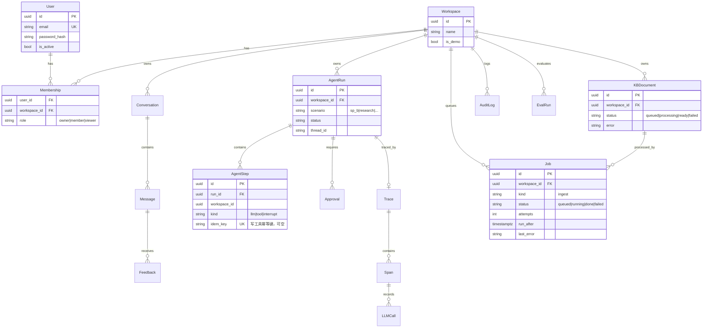
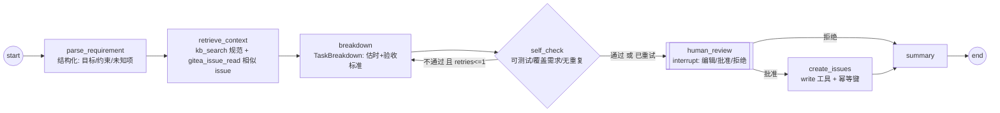

# Day 59 · 2026-11-25 · Week 17 Task 2：架构 v2 + 数据模型

## 0. 今天只做一件事

写 `docs/architecture-v2.md`（架构图 v2 + 16 实体 ER 图 + SQLite→Postgres 迁移方案 + SP-B 场景图）和 `docs/adr/0007-multi-tenancy.md`。

不碰：任何代码实现、安装 Postgres、Alembic、前端（全部 W18/W19 做）。

## 1. 资产锚点

- 构建模块：M11.1 认证 / M11.2 数据隔离（设计）、M10 场景图（设计）、M5.4 异步导入与部署链路（设计）（见 plan/DA01_TARGET_ASSET.md §5）
- 版本里程碑：为 v1.1（场景 MVP）与 v1.2（Postgres + 认证 + 多空间）做准备
- 今天之后 WorkPilot 多了什么（可演示/可测量）：一份可直接对照编码的架构 v2 文档；W19 建表时 16 实体、字段、索引都有据可依
- 今日 AI 实际应用：用 AI 根据你写的实体清单生成 mermaid ER 草图，再人工逐条校对外键与 `workspace_id` → 用在 architecture-v2.md

## 2. 起点（前置确认）

- 已有：Day58 的 `docs/product/p3-definition.md`；v1 `docs/architecture.md`；`docs/adr/0001–0006`；`docs/open-core.md`（W16）。
- 需确认：

```bash
cd ~/lab/workpilot
ls docs/adr/                                     # 确认最大编号是 0006
grep -n "class .*SQLModel" apps/api/app/db/models.py   # 列出现有表
grep -n -i "pro\|open" docs/open-core.md | head  # 回顾开源边界
```

## 3. 验收对齐（做完要能勾掉）

- [ ] architecture-v2.md 中架构图 v2 标出 4 条信任边界（浏览器 / API / 外部内容 / LLM）
- [ ] ER 图含 16 实体：User、Workspace、Membership、KBDocument、Conversation、Message、Feedback、AgentRun、AgentStep、Approval、Trace、Span、LLMCall、AuditLog、EvalRun、Job
- [ ] 除 User 外每个业务实体都有 `workspace_id`（或通过父表可追溯，并写明理由）
- [ ] 迁移方案包含「备份 → 导出使用数据 → 新库建表 → 数据处理 → 校验」5 步
- [ ] ADR 0007 含 上下文 / 选项 / 决策 / 后果，结论为单 collection + payload 过滤
- [ ] 场景图含 7 节点、self_check→breakdown 回边（最多 1 次）、human_review interrupt、写工具幂等键说明
- [ ] 已写明 P3 代码的开源边界决定（公开 / 私有）

## 4. 时间块（≤ 120 分钟）

| 时间        | 优先级 | 内容                                    |
| ----------- | ------ | --------------------------------------- |
| 0–30 min    | P0     | ER 图 + 字段 / 索引表                   |
| 30–55 min   | P0     | ADR 0007                                |
| 55–75 min   | P0     | 场景图（节点 / 边 / interrupt）         |
| 75–95 min   | P1     | 架构图 v2 + 信任边界 + 异步导入链路     |
| 95–110 min  | P1     | SQLite→Postgres 迁移方案 + 开源边界决定 |
| 110–120 min | P0     | 提交                                    |
| 顺延        | P2     | 时序图（登录 / 审批）→ Backlog          |

时间不足时最低保留：ER 图 + ADR 0007 + 场景图草图。

## 5. 今日学习（只学完成任务必须的）

- **共享 schema 多租户**：所有租户共用表，用 `workspace_id` 行级区分；隔离靠「仓储层强制过滤 + 测试」而不是靠开发者记得加 where。
- **Qdrant 多租户**：官方建议单 collection + payload 分区，`workspace_id` 建 keyword payload 索引（可设 `is_tenant=true` 优化存储布局）；每租户一个 collection 只适合租户少、需强隔离的情况。
- **Membership 是多对多 + 角色**：用户可属于多个空间，角色挂在成员关系上，而不是用户上。
- **LangGraph interrupt**：节点内调用 `interrupt()` 暂停图并持久化状态，`Command(resume=...)` 恢复；恢复时该节点会**从头重新执行**，所以 interrupt 之前不能有副作用。
- 资料：https://qdrant.tech/documentation/guides/multiple-partitions/ 、https://langchain-ai.github.io/langgraph/ 、https://mermaid.js.org/syntax/entityRelationshipDiagram.html

## 6. 执行步骤

### Step 1 · ER 图（P0，30 分钟）

可让 AI 根据实体清单出草稿，**外键和 workspace_id 必须自己逐条核对**。写入 `docs/architecture-v2.md` 的「数据模型」节：



> 其余实体（Conversation / Message / Feedback / Approval / Trace / Span / LLMCall / AuditLog / EvalRun）字段在下方表格列出即可，ER 图里只画关系，避免图过大。

紧跟一个字段/索引表：

| 表                                   | workspace_id             | 关键索引                                           | 备注                                                                       |
| ------------------------------------ | ------------------------ | -------------------------------------------------- | -------------------------------------------------------------------------- |
| Membership                           | ✅                       | unique(user_id, workspace_id)                      | 角色在这里                                                                 |
| Message / AgentStep / Span / LLMCall | ✅（冗余）               | (workspace_id, created_at)                         | 冗余存储方便按空间统计成本，避免多层 join                                  |
| Feedback                             | ✅                       | (workspace_id, status)                             | W20 加 `kind`（explicit/implicit_edit）与 `status`（new/promoted/ignored） |
| AuditLog                             | ✅（登录失败可空）       | (workspace_id, ts)                                 | 只追加，不更新                                                             |
| Job                                  | ✅                       | partial index on (run_after) where status='queued' | worker 取任务用                                                            |
| EvalRun                              | ✅（全局评测用系统空间） | (suite, created_at)                                | W20 评测趋势页                                                             |

### Step 2 · ADR 0007 多租户（P0，25 分钟）

`docs/adr/0007-multi-tenancy.md`：

```markdown
# ADR 0007：多租户数据隔离方案

- 状态：Accepted（2026-11-25）

## 上下文

v1.2 起支持多工作空间，空间间文档、对话、运行、检索结果必须互不可见。规模：≤ 50 空间、每空间 ≤ 5 万 chunk；单机 2C4G。

## 选项

| 方案                                                                   | 优点                                                    | 缺点                                                                 |
| ---------------------------------------------------------------------- | ------------------------------------------------------- | -------------------------------------------------------------------- |
| A 单 collection + workspace_id payload 过滤（keyword 索引, is_tenant） | 资源占用低；官方推荐；新增空间零成本；备份一个 snapshot | 忘加过滤即泄露 → 需仓储层强制 + 断言 + 测试                          |
| B 每空间一个 collection                                                | 物理隔离；删空间=删 collection                          | collection 多时内存/文件句柄开销大；备份与迁移复杂；schema 变更 N 次 |
| C 每空间一个 Qdrant 实例                                               | 最强隔离                                                | 2C4G 不可行                                                          |

## 决策

选 A。DB 侧同理：行级 workspace_id + 仓储层强制过滤。

## 后果

- 所有检索入口必须经 `store.search(workspace_id, ...)`，函数签名强制传入；返回结果再做一次断言。
- 隔离自动化测试进入 CI（W19）。
- 若未来出现需要物理隔离的付费客户，再引入方案 B 作为 Pro 选项（写新 ADR）。
```

### Step 3 · SP-B 场景图（P0，20 分钟）



设计要点写在图下方：

- State 字段：`workspace_id, run_id, requirement, parsed, context, breakdown, check, retries, approved, issues, summary`。
- 幂等键：`idem_key = sha256(run_id + task.title)[:16]`，写 AgentStep 时唯一约束；重放时已存在则复用结果。
- 只有 `create_issues` 是写操作，它只能出现在 interrupt 之后；viewer 角色在 API 层就拒绝启动写场景。
- checkpointer 沿用 W12 的 SqliteSaver（文件放 volume），PostgresSaver 进 Backlog。

### Step 4 · 架构图 v2 + 迁移方案（P1，35 分钟）

架构图在 v1 基础上增加：`Auth/RBAC 中间件`、`Postgres 16`、`worker（同镜像）`、`Job 表`、`场景包 SP-B`、`Gitea 容器仓库 → 服务器` 部署链路，并用 `subgraph` 标出信任边界：浏览器（不可信输入）/ API（可信）/ 外部内容（文档、网页、Gitea issue、MCP 客户端，均视为不可信）/ LLM（输出不可信）。

迁移方案（写成清单）：

```text
1. 备份：cp workpilot.db workpilot-20261128.db；sqlite3 workpilot.db .dump > backup.sql
2. 导出使用数据：Conversation/Message/Feedback/AgentRun → JSONL（保住 §11「真实使用 ≥30」证据）
3. 新库：docker compose 起 postgres:16 → alembic upgrade head（W19 Day62）
4. 数据：KB 文档与向量 → 按 default 空间重新导入（可重建）；使用数据 → scripts/migrate_sqlite_to_pg.py（P1，只迁 4 张表并补 workspace_id=default）
5. 校验：行数对比 + 随机抽 5 条会话在新 UI 可见
```

### Step 5 · 开源边界决定（P1，10 分钟）

在 architecture-v2.md 末尾写「代码存放决定」：

| 选项                        | 说明                                                                                                         |
| --------------------------- | ------------------------------------------------------------------------------------------------------------ |
| 默认推荐：全部代码 MIT 公开 | 求职证据最大化；Pro Kit 卖「省时间」：一键生产部署包 + 部署手册 + 场景包 prompt/rubric/评测集 + 6 个月更新   |
| 备选：Pro 模块私有          | 若 W16 `open-core.md` 规定认证/多空间属于 Pro，则这些代码放私有 Gitea 仓库 `workpilot-pro`，不做 GitHub 镜像 |

> 以 W16 的 open-core.md 为准，选一个写进去，W19 编码前不再改。

### Step 6 · 提交

```bash
git add docs/architecture-v2.md docs/adr/0007-multi-tenancy.md
git commit -m "docs(arch): add architecture v2, ER model and ADR 0007 multi-tenancy"
git push
```

## 7. 概念自检（不看资料，口述，附答案）

1. 为什么角色放在 Membership 而不是 User？（答：同一用户在不同空间角色不同；User 只管身份，Membership 管授权）
2. 单 collection 方案最大的风险是什么，怎么控？（答：漏加过滤导致跨空间泄露；控制：检索函数签名强制 workspace_id、must 过滤、结果断言、自动化隔离测试）
3. 为什么 Message / Span 冗余存 workspace_id？（答：按空间统计成本/查询时不用多层 join，也方便仓储层统一强制过滤）
4. interrupt 恢复时节点会怎样执行？对设计有什么影响？（答：节点从头重新执行；所以 interrupt 前不能有写操作，写工具放到独立节点并带幂等键）
5. 为什么迁移前先导出使用数据？（答：会话/反馈是半年验收「真实使用 ≥30」的证据，KB 可重建但使用记录不可重建）

## 8. 对 DA-01 的贡献

DA-01 从单用户单库升级为「多空间、可认证、可异步处理、可审批写入」的生产架构蓝本。W18 场景实现、W19 Postgres/认证/隔离、W21 安全加固都按本文件落地；ADR 0007 是 P3 作品集 Architecture 一节的核心论据。

## 9. 求职映射（D 线）

- 岗位能力：多租户 SaaS 架构、数据建模、架构决策记录、Agent 工作流设计。
- 对应岗位：AI Platform Engineer、AI Full-Stack Engineer、Backend Engineer（AI 方向）。
- 简历 bullet 草稿：「设计 16 实体的多租户数据模型与 LangGraph 场景图（含人工审批中断与写操作幂等键），以 ADR 记录向量库隔离方案取舍」
- 面试可能问：
  1. 如何保证多租户 RAG 不串数据？——要点：鉴权得出 workspace_id（不信任客户端传的值本身，需校验 membership）→ 仓储/检索层强制过滤 → 结果断言 → 隔离测试进 CI。
  2. Agent 写操作如何防重复？——要点：interrupt/重试会导致节点重放；幂等键 + 唯一约束 + 先查后写。

## 10. 卡住时的处理

| 现象                                | 处理                                                                                           |
| ----------------------------------- | ---------------------------------------------------------------------------------------------- |
| mermaid ER 图渲染失败               | 去掉属性中的特殊字符（括号、中文冒号），注释用双引号；VS Code 预览或 https://mermaid.live 调试 |
| 实体太多图太乱                      | ER 图只画关系 + 3–4 个核心实体属性，其余用表格                                                 |
| 纠结 Approval 和 AgentStep 是否合并 | 不合并：Approval 有审批人、决定、编辑 diff，是审计对象                                         |
| open-core.md 没写清边界             | 采用默认推荐（全部公开），在 CHANGELOG 待办里记一句，W22 定价时再确认                          |
| ADR 写不出「后果」                  | 写 3 条：要做的约束、要加的测试、什么情况下推翻                                                |
| 超时                                | 保 ER + ADR，场景图明天开头 15 分钟画                                                          |

## 11. 产出记录（执行时填写）

- ER 实体数：** / 带 workspace_id：**
- ADR 0007 结论：\_\_\_\_
- 场景图节点数：** / interrupt 点：**
- 开源边界决定：公开 / 私有
- 用时：\_\_ 分钟
- 卡点：\_\_\_\_

## 12. 完成判定

第 3 节全部勾上 → Task 2 DONE → 明天进入 Day60 · W18 Task 1「主场景包工作流实现」。任一未通过 → 保持 IN PROGRESS，明天先补 P0（ER 图 / ADR 0007 / 场景图）。
