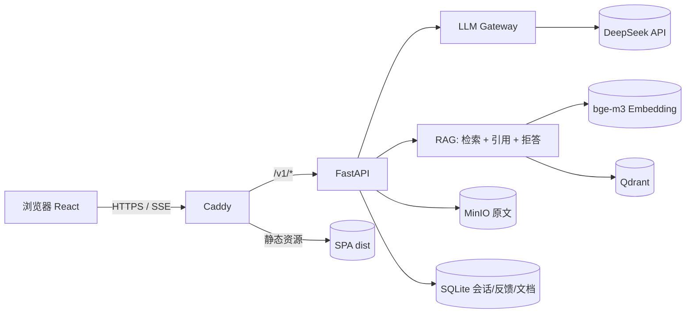
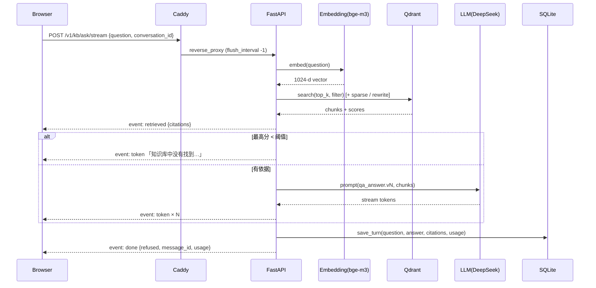

# Day 30 · 2026-10-27 · Week 08 Task 1：README + 架构图 + ADR

## 0. 今天只做一件事

写出招聘方视角的 `README.md`、`docs/architecture.md`（三张 mermaid 图）和 ADR 0001 / 0002 / 0004 / 0005，补全 `docs/runbook.md`，让一个陌生人 5 分钟内看懂 WorkPilot 是什么、怎么设计的、效果多少、怎么跑。

不碰：Demo 录制（Day31）、GitHub 公开（Day32）、任何新功能或重构、README 徽章 / 样式打磨。

## 1. 资产锚点

- 构建模块：M13.2 项目写作：P1 技术复盘（README / 架构 / ADR）（见 plan/plan_ai/DA01_TARGET_ASSET.md §5）
- 版本里程碑：为 v0.5 做准备
- 今天之后 WorkPilot 多了什么（可演示/可测量）：仓库首页即作品集首页；评测数字可追溯到报告；5 篇 ADR 解释关键选型
- 今日 AI 实际应用：把 W2–W7 的 AI 工程决策（LLM 网关、向量库、手写 RAG、评测指标）显式化为可审阅的文档——面试中「讲清 RAG 架构」的书面版本

## 2. 起点（前置确认）

- 已有：`docs/adr/0003-*.md`（W5）、`eval/reports/*`、`docs/runbook.md`（Day28–29 部分）、`.env.example`。
- 需确认并把数字抄到 draft.md（README 只能用这些真实数字）：

```bash
cd ~/lab/workpilot
ls docs/adr eval/reports
grep -nE "hit@5|MRR|引用正确|拒答|P95|成本" eval/reports/*.md | tail -20
git tag --sort=-creatordate | head -5
python3 --version; node -v; grep -E '"(react|vite|tailwindcss)"' apps/web/package.json
```

## 3. 验收对齐（做完要能勾掉）

- [ ] `README.md` 含 11 个部分（Step 1 骨架），首屏有一句话定位 + GIF 占位 + 快速开始入口
- [ ] README 评测表每个数字后有报告文件链接
- [ ] README 快速开始 3 条命令在本机复制粘贴即可执行（`make down` 后重新验证一次）
- [ ] `docs/architecture.md` 3 张 mermaid（flowchart / sequenceDiagram / erDiagram）在 VS Code Markdown 预览中正常渲染
- [ ] ADR 0001、0002、0004、0005 已写，均含「状态 / 背景 / 决策 / 备选方案 / 后果」
- [ ] runbook 含：本地启动、部署、备份、恢复、常见故障 5 节；已 commit + push

## 4. 时间块（≤ 120 分钟）

| 时间    | 优先级 | 内容                                           |
| ------- | ------ | ---------------------------------------------- |
| 0–10    | P0     | 收集事实与数字                                 |
| 10–45   | P0     | README（AI 起草骨架，你填事实和取舍）          |
| 45–70   | P0     | architecture.md 三张图                         |
| 70–100  | P0     | ADR 0002、0004（面试最常问）→ 0001、0005       |
| 100–110 | P0     | runbook 补全 + 快速开始实测 + 提交             |
| 110–120 | P1     | README 英文一句话摘要（便于海外 / 外企招聘方） |

时间不足时最低保留：README（含架构 mermaid + 评测表 + 快速开始）+ ADR 0002 / 0004。

## 5. 今日学习（只学完成任务必须的）

- 招聘方阅读顺序：一句话定位 → Demo → 结果数字 → 架构 → 技术栈 → 能否跑起来；README 按这个顺序排。
- ADR（Architecture Decision Record）：一篇只记一个决策，写清当时的约束和放弃的方案；状态可为 Proposed / Accepted / Superseded。
- Mermaid 在 GitHub / Gitea / VS Code 均可直接渲染，图即代码，可随代码一起评审。
- 资料：https://adr.github.io/ 、https://mermaid.js.org/syntax/flowchart.html 、https://mermaid.js.org/syntax/sequenceDiagram.html 、https://mermaid.js.org/syntax/entityRelationshipDiagram.html 、https://docs.github.com/en/repositories/managing-your-repositorys-settings-and-features/customizing-your-repository/about-readmes

## 6. 执行步骤

### Step 1 · README 骨架（让 AI 按此生成初稿，你逐段替换为真实内容）

````markdown
# WorkPilot

> 可私有部署的研发知识 AI 助手：导入团队文档，给出**带段落引用**的答案，知识不足时**明确拒答**；自带评测与一键部署。

 <!-- Day31 替换 -->

[快速开始](#快速开始) · [架构](docs/architecture.md) · [评测报告](eval/reports/) · [设计决策](docs/adr/) · [运行手册](docs/runbook.md)

## 功能

- 文档上传（md / pdf / html / txt）→ 异步解析、分块、向量化，状态可见
- 流式问答 + 段落级引用溯源 + 库外拒答
- 会话历史、👍/👎 + 原因反馈 → 一键导出为评测 badcase
- 50 题评测集：检索指标 + LLM-as-judge，报告入库可追溯
- Docker Compose + Caddy 一键部署，健康检查、request_id 日志、备份恢复

## 架构



## 评测结果（50 题，报告：eval/reports/<文件>.md）

| 指标                | 基线 v0.2 | 当前 v0.5 | 目标           |
| ------------------- | --------- | --------- | -------------- |
| hit@5               | \_\_      | \_\_      | ≥ 0.85         |
| 引用正确率          | \_\_      | \_\_      | ≥ 0.80         |
| 库外拒答率          | \_\_      | \_\_      | ≥ 0.80         |
| P95 延迟 / 单次成本 | \_\_      | \_\_      | < 8s / < ¥0.02 |

## 快速开始

```bash
git clone <repo-url> && cd workpilot
cp .env.example .env   # 填写 LLM_API_KEY 等（见注释）
make up && make seed   # 打开 http://localhost:8080
```

前置：Docker Desktop；Embedding 使用本机 Ollama（`ollama pull bge-m3`）或在 .env 中改为 SiliconFlow。

## 技术栈 / 设计决策 / 路线图 / License

（技术栈表；ADR 0001–0005 链接各一句话；路线图：P2 Agent + MCP（v1.0）、P3 生产化多空间（v2.0）；MIT）
````

写作要求：数字全部来自报告，没有就写「待测」而不是编；不出现公司名、同事名、内网地址。

### Step 2 · docs/architecture.md

三部分：

1. **组件图**：复用 README 的 flowchart，补上 dev / prod 差异（Ollama ↔ SiliconFlow、basic auth）。
2. **问答链路**（必须自己写，这是面试白板题）：



3. **数据模型**：`erDiagram` 画 `CONVERSATION ||--o{ MESSAGE`、`MESSAGE ||--o| FEEDBACK`、`KB_DOCUMENT ||--o{ QDRANT_POINT : "payload.doc_id"`；下方用表格写 Qdrant payload 字段（doc_id / title / section / chunk_index / text）。

拒答分支的阈值、top_k、chunk size 写你 W5 定下的真实值。

### Step 3 · ADR（docs/adr/，统一模板）

```markdown
# ADR 0004：RAG v1 不使用 LangChain，手写检索与生成链路

- 状态：Accepted（2026-10-12，W4）
- 背景：P1 需要可解释、可评测、可调参的 RAG；作者需在面试中讲清每一步原理；每天 1–2 小时，调试框架抽象成本高。
- 决策：loaders / chunking / embedding / retrieve / answer 全部手写（约 \_\_ 行），只依赖 openai SDK、qdrant-client。
- 备选方案：
  - LangChain / LlamaIndex：上手快、生态全；但抽象层深，评测时难以定位是哪一步出错，版本变动频繁。
  - Haystack：pipeline 清晰；但同样引入大量不需要的组件。
- 后果：
  - 正面：每个环节可单测、可在评测报告中单独度量（hit@5 vs 生成质量）；依赖少，镜像小。
  - 负面：loader 种类少、需自己维护；W11 Agent 层引入 LangGraph（ADR 另记）。
- 复审条件：需要支持 > 10 种数据源，或团队协作需要统一框架时。
```

其余三篇要点（每篇 15–30 行）：

| ADR                       | 决策                                                                      | 必写的备选与理由                                                                     |
| ------------------------- | ------------------------------------------------------------------------- | ------------------------------------------------------------------------------------ |
| 0001 LLM 供应商与网关     | DeepSeek 为默认，OpenAI 兼容协议自建网关（超时 / 重试 / fallback / 计量） | 直接调 SDK（无法统一计量与切换）；LiteLLM（多一层服务）；Qwen / OpenAI 作为 fallback |
| 0002 选择 Qdrant          | 单容器、payload 过滤、hybrid、快照                                        | pgvector（W19 有 Postgres 后可再评估）、Milvus（太重）、Chroma（生产能力弱）         |
| 0005 Compose + Caddy 部署 | 单机 Compose，Caddy 自动 HTTPS + SSE 反代                                 | K8s（超出规模）、Nginx + certbot（多一步证书运维）、Cloudflare Tunnel（作为备选）    |

### Step 4 · runbook 补全（docs/runbook.md）

目录：1 本地开发（`make dev` / `make web`）· 2 本地全栈（`make up/down/logs/seed`）· 3 云部署（Day28）· 4 备份与恢复（Day29，含 RTO 记录）· 5 常见故障（SSE 不流式、证书失败、`/ready` 503、Embedding 连接失败、CI runner 离线，各 1–2 行处理）。

### Step 5 · 验证 + 提交

```bash
make down && make up && make seed      # 按 README 快速开始走一遍
git add README.md docs/
git commit -m "docs: recruiter-facing readme, architecture diagrams and ADRs 0001/0002/0004/0005"
git push
```

## 7. 概念自检（不看资料，口述，附答案）

1. README 为什么把评测数字放在架构前面？（答：招聘方先关心「效果如何、是否真实」，再关心「怎么做的」；数字 + 报告链接建立可信度）
2. ADR 和普通设计文档的区别？（答：一篇一个决策、记录当时约束和放弃的方案、不可改写只可被新 ADR 取代，保留决策演化历史）
3. 在 sequenceDiagram 中，为什么 `retrieved` 事件在 LLM 调用之前发出？（答：先把引用给前端，用户在等待生成时已能看到依据，降低感知延迟，也支持拒答分支）
4. 为什么写「复审条件」？（答：说明决策不是教条，明确什么情况下应重新评估，体现工程判断）

## 8. 对 DA-01 的贡献

F8「完整文档：README、架构、部署、运行手册」落地。这些文档同时是 W16 P2、W22 Pro Kit「部署手册」、W23 Portfolio 网站的内容来源；ADR 目录从此成为每次重大选型的固定归档位置。

## 9. 求职映射（D 线）

- 岗位能力：技术写作、架构表达、决策权衡
- 对应岗位：AI Engineer / AI Full-Stack / 任何需要设计评审的岗位
- 简历 bullet 草稿：为项目编写架构文档与 5 篇 ADR（LLM 网关、向量库选型、无框架 RAG、部署方案），沉淀选型依据与复审条件。
- 面试可能问：
  - 「画一下你的 RAG 系统架构，讲一次请求的全过程。」要点：按 sequenceDiagram 讲；强调先检索事件、拒答分支、落库、usage 计量。
  - 「为什么选 Qdrant 不选 pgvector？」要点：当时无 Postgres、需要 hybrid 与 payload 过滤、单容器运维简单；W19 有 Postgres 后可复审。

## 10. 卡住时的处理

| 现象                                          | 处理                                                                         |
| --------------------------------------------- | ---------------------------------------------------------------------------- |
| mermaid 预览报 `Parse error`                  | 节点文本含括号 / 冒号时用引号包住，如 `A["FastAPI (api)"]`；分步删减定位     |
| 不知道写哪个数字（报告有多版）                | 用 W5 定配置那一版作为 v0.3 / 当前值，基线用 W4 v0.2；在表格下注明报告文件名 |
| 某些指标没测过（如 P95）                      | 写「待测」，Day33 验收时补测；绝不估算填写                                   |
| AI 生成的 README 夸大（「企业级」「高性能」） | 删掉形容词，换成数字或删掉该句                                               |
| 快速开始实测失败                              | 立即修 README 或 Makefile，这正是 Day33 干净环境要避免的问题                 |

## 11. 产出记录（执行时填写）

- README 引用的报告文件：\_\_\_\_
- 评测数字（hit@5 / 引用正确率 / 拒答率 / P95 / 成本）：\_\_\_\_
- ADR 完成篇数：\_\_\_\_
- 卡点：\_\_\_\_
- 用时：\_\_\_\_ 分钟

## 12. 完成判定

第 3 节全部勾上 → Task 1 DONE → 明天进入 Day31（Demo 录制 + 技术复盘 8 问）。任一未通过 → 保持 IN PROGRESS，明天先补 P0。
